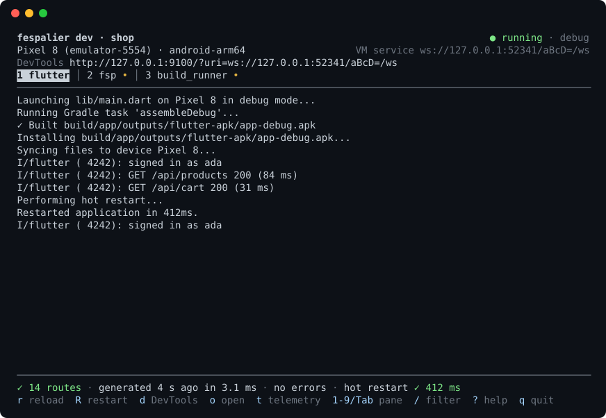

# fespalier

File-tree routing for Flutter, in the spirit of Next.js. An espalier is a tree
trained flat against a frame; here the frame is `lib/app/`.

You write plain widgets and functions in small files under `lib/app/`. There are no
base classes or interfaces to implement: the file name says what a file is, and its
constructor says what it needs. The `fsp` generator reads every file and writes one
typed, mountable `lib/app.g.dart`. It's built on go_router, Riverpod and flutter_hooks,
with no build_runner. This is an early version (pre-1.0).

[Documentation](docs/README.md) · [Examples](examples) · [Changelog](CHANGELOG.md)

## At a glance

```text
lib/main.dart            Future<void> main() => AppMain.run();
lib/app/
  layout.dart            AppLayout({required Widget child})            the shell around everything below
  page.dart              HomePage()                                     → /
  products/
    page.dart            ProductsPage({required List<Product> products})   → /products
    $id/
      data.dart          Future<Product> data(Ref ref, {required int id})
      page.dart          ProductPage({required Product product})           → /products/:id
      action.dart        Future<void> action(Ref ref, {required int id, required Refund input})
  checkout/guard.dart    GuardResult guard(Ref ref)                     guards this folder and below
  (account)/             a group: a shared layout, nothing added to the URLs
  _components/           private: never routes
```

```dart
Future<void> main() => AppMain.run();                       // the whole main()

ProductRoute(id: 42).go(context);                           // typed navigation
ProductRoute.watch(ref, id: 42);                            // the route's data: AsyncValue<Product>
await ProductRoute.submit(ref, id: 42, input: refund);      // its write, with pending and error state

GoRouter(routes: [...legacyRoutes, ...AppRoutes.mount(at: '/shop')]);   // or inside a GoRouter you have
```

Every file kind is in [File kinds](docs/file-kinds.md#at-a-glance), and the typed
side is in [Navigation](docs/navigation.md#typed-navigation-at-a-glance).

## How it works

```text
 your files              fsp gen · fsp watch · fsp dev          the generated file          what runs
 lib/app/**/*.dart  ───────────────────────────────────▶  lib/app.g.dart  ─────────▶  go_router + Riverpod
                                                           typed routes, providers,    MaterialApp.router, or
                                                           AppRoutes                   AppRoutes.mount(at:) in your GoRouter
```

- `fsp` reads each constructor to work out what every parameter should receive.
- An error points at the parameter at fault, and `app.g.dart` is left untouched while there is one.
- Commit `lib/app.g.dart`, or generate it in CI: [Keeping app.g.dart](docs/getting-started.md#keeping-appgdart).

## Getting started

You need Flutter 3.32 or newer (Dart 3.8) for the package. go_router 18 needs Flutter
3.44 or newer.

**1. Install `fsp`.** On Linux and macOS:

```sh
curl -fsSL https://raw.githubusercontent.com/fespalier/fespalier/main/install.sh | sh
```

It puts `fsp` in `~/.local/bin` and checks the download's SHA-256. Set `FSP_VERSION=v0.14.0` <!-- x-release-please-version -->
to pick a release (the default is the latest). On Windows, in PowerShell:

```powershell
irm https://raw.githubusercontent.com/fespalier/fespalier/main/install.ps1 | iex
```

With Rust installed, on any platform:

<!-- x-release-please-start-version -->

```sh
cargo install --git https://github.com/fespalier/fespalier --tag v0.14.0 fespalier
```

<!-- x-release-please-end -->

With Homebrew or Scoop ([details](docs/getting-started.md#homebrew-and-scoop)):

```sh
brew tap fespalier/tap && brew install fsp
scoop bucket add fespalier https://github.com/fespalier/scoop-bucket && scoop install fsp
```

Or install nothing: once the package is in your `pubspec.yaml`, `dart run fespalier <command>` runs `fsp`
for you. [Installation and setup](docs/getting-started.md#install-fsp) has every way, and the environment variables.

**2. Add the package** to your app's `pubspec.yaml`, then run `flutter pub get`:

<!-- x-release-please-start-version -->

```yaml
dependencies:
  fespalier:
    git:
      url: https://github.com/fespalier/fespalier
      path: packages/fespalier
      ref: v0.14.0
```

<!-- x-release-please-end -->

It depends on go_router (17 or 18), hooks_riverpod 3 and flutter_hooks, and
`package:fespalier/fespalier.dart` re-exports all three, so you don't add them yourself.

Starting a new app? `fsp create my_app` makes it with fespalier in it and replaces steps 2 and 3
([`fsp create`](docs/cli.md#fsp-create)); the rest is for an app you already have.

**3. Run `fsp init`** in the project root. It creates a layout, a page, `not_found.dart`,
`transition.dart` and `app.dart`, writes `lib/app.g.dart`, and never overwrites a file that exists.
Delete `test/widget_test.dart` if `flutter create` wrote one: it refers to the `MyApp` that `fsp init` replaced.
Then replace `lib/main.dart` with:

```sh
fsp init
```

```dart
// lib/main.dart
import 'package:my_app/app.main.g.dart';

Future<void> main() => AppMain.run();
```

**4. Day to day.**

```sh
fsp dev                                   # the app, regenerated and hot restarted on every save
fsp new 'orders/[id]' --data --loading    # the folder orders/$id: page, data.dart, loading.dart
```

Next: [Installation and setup](docs/getting-started.md) (CI, committing `app.g.dart`, platform notes),
[Configuration](docs/configuration.md), and [Migration](docs/migration.md) if you already have a `GoRouter`.



## Packages

`fsp` and the Dart package `fespalier` are what you need. Every other package is optional and is a git
dependency at the same release tag ([Companion packages](docs/getting-started.md#companion-packages)).

| Package                  | What it adds                                                                           | Docs                                                                               |
| ------------------------ | -------------------------------------------------------------------------------------- | ---------------------------------------------------------------------------------- |
| `fsp`                    | the generator and the commands around it                                               | [CLI reference](docs/cli.md)                                                       |
| `fespalier`              | the runtime `app.g.dart` imports, and `testing.dart`                                   | [File kinds](docs/file-kinds.md)                                                   |
| `fespalier_otel`         | OpenTelemetry spans for navigations, guards, data and actions                          | [Observability](docs/observability.md#telemetry)                                   |
| `fespalier_sentry`       | Sentry errors tagged with the route and the file                                       | [Sentry](docs/observability.md#sentry-fespalier_sentry)                            |
| `fespalier_auth`         | signed-in routes: session, guards, refresh, OpenID Connect                             | [Authentication](docs/auth.md)                                                     |
| `fespalier_sign_keypair` | device-bound tokens (DPoP) for `fespalier_auth`                                        | [DPoP](docs/auth.md#device-bound-tokens-dpop-with-fespalier_sign_keypair)          |
| `fespalier_flags`        | feature flags that guards watch                                                        | [Feature flags](docs/guards.md#feature-flags-fespalier_flags)                      |
| `fespalier_storage`      | a `dataCache` on shared_preferences or Hive                                            | [A cache on disk](docs/data.md#a-cache-on-disk-fespalier_storage)                  |
| `fespalier_connectivity` | a reconnect signal and a `hasNetwork` provider                                         | [Reconnects](docs/data.md#reconnects-fespalier_connectivity)                       |
| `fespalier_adaptive`     | menus as a bar, a rail or a drawer by window width                                     | [Adaptive navigation](docs/layouts.md#a-bar-a-rail-or-a-drawer-fespalier_adaptive) |
| `fespalier_image`        | responsive CDN images                                                                  | [Images](docs/responsive-images.md)                                                |
| `fespalier_forms`        | the form of an `action.dart`: typed fields, validation, server errors (since 0.11.0)   | [Forms](docs/forms.md)                                                             |
| `fespalier_maps`         | a MapLibre pin picker that returns a place (since 0.13.0)                              | [Maps](docs/maps.md)                                                               |
| `fespalier_biometrics`   | a biometric unlock guard that never prompts twice (since 0.13.0)                       | [Biometric unlock](docs/guards.md#biometric-unlock-fespalier_biometrics)           |
| `fespalier_frb`          | a Rust core's change stream: providers rebuilt by its events (since 0.13.0)            | [A Rust core's changes](docs/data.md#a-rust-cores-changes-fespalier_frb)           |
| `fespalier_riverpod`     | a provider per page instance: two pushes, two states (since 0.13.0)                    | [Page state](docs/data.md#providers-per-page-instance-fespalier_riverpod)          |
| `fespalier_dio`          | Dio and `package:http`: cancellation, field errors, writes never retried               | [HTTP clients](docs/http.md)                                                       |
| `fespalier_cratestack`   | a CrateStack client behind `data.dart` and `action.dart`, offline-first (since 0.10.0) | [CrateStack](docs/cratestack.md), [Offline-first](docs/offline-first.md)           |
| `fespalier_tolgee`       | translations from Tolgee or your own server, offline-safe (since 0.10.0)               | [Translations](docs/i18n-tolgee.md)                                                |
| `fespalier_push`         | notification taps open typed routes, cold start and warm (since 0.13.0)                | [Push notifications](docs/push.md)                                                 |
| `fespalier_analytics`    | screen views by route pattern, sent only with consent (since 0.13.0)                   | [Analytics](docs/analytics.md)                                                     |
| DevTools extension       | routes, guards, data and actions in Flutter DevTools                                   | [DevTools extension](docs/devtools.md)                                             |
| Editor plugins           | `fsp` diagnostics in VS Code and IntelliJ                                              | [Editor plugins](docs/cli.md#editor-plugins)                                       |

## Documentation

<!-- markdownlint-disable MD033 -->
<!-- The <a name> anchors keep every old README heading link working (docs/README.md, "Old README sections"). -->

### Basics

- [Installation and setup](docs/getting-started.md)
- [Configuration](docs/configuration.md)
- <a name="file-kinds"></a><a name="function-views"></a><a name="file-names"></a><a name="how-parameters-are-filled"></a>[File kinds](docs/file-kinds.md)
- [Migration](docs/migration.md)

### Routing

- <a name="segment-types"></a><a name="enum-segments"></a><a name="catch-all-segments"></a><a name="typed-catch-alls"></a><a name="case-and-trailing-slashes"></a><a name="localized-paths"></a><a name="non-ascii-spellings"></a><a name="group-folders"></a><a name="a-sibling-with-a-compound-path"></a><a name="not-found-views"></a><a name="query-parameters"></a><a name="route-manifest-and-metadart"></a>[Routing](docs/routing.md)
- <a name="the-root-navigator-navigatordart"></a><a name="presentdart-a-page-of-your-own"></a><a name="the-url-as-state-of-and-copywith"></a><a name="remounting-a-page-remount"></a><a name="typed-extra"></a><a name="restoring-extra-on-the-web"></a><a name="links-routelink"></a><a name="preloading-the-data-behind-a-link"></a><a name="deferred-routes-a-pages-code-on-demand"></a>[Navigation](docs/navigation.md)
- <a name="tab-layouts"></a><a name="menus-and-breadcrumbs-navdart"></a><a name="a-bar-a-rail-or-a-drawer-fespalier_adaptive"></a><a name="transitions"></a><a name="shared-elements-heroes"></a><a name="state-restoration"></a><a name="scroll-restoration"></a>[Layouts](docs/layouts.md)
- <a name="guards"></a><a name="redirectdart"></a><a name="sending-people-back"></a><a name="feature-flags-fespalier_flags"></a><a name="where-flag-values-come-from"></a><a name="testing-flagged-routes"></a>[Guards](docs/guards.md)

### Data and writes

- <a name="datadart-a-function-a-selector-or-a-provider"></a><a name="retries-and-reloads"></a><a name="freshness-staletime-resume-and-reconnect"></a><a name="reconnects-fespalier_connectivity"></a><a name="a-cache-that-survives-a-restart-datacache"></a><a name="a-cache-on-disk-fespalier_storage"></a><a name="typed-helpers-on-the-route"></a><a name="from-a-location-to-its-data"></a><a name="section-data"></a>[Data](docs/data.md)
- <a name="actiondart-typed-writes"></a><a name="optimistic-updates-optimistic"></a>[Actions](docs/actions.md)
- <a name="forms-form-and-validate"></a>[Forms](docs/forms.md)
- <a name="http-clients-fespalier_dio"></a><a name="cancelling-a-load-whose-page-is-gone"></a><a name="server-validation-errors-on-forms"></a><a name="writes-are-never-retried-over-http-too"></a>[HTTP clients](docs/http.md)

### App

- <a name="main-appdart-startupdart-and-splashdart"></a>[`main()`, app.dart, startup.dart and splash.dart](docs/app-startup.md)
- <a name="adapters-in-the-generated-main"></a>[Adapters](docs/adapters.md)
- <a name="authentication"></a><a name="installing-fespalier_auth"></a><a name="the-session"></a><a name="restoring-at-startup"></a><a name="guarding-signed-in-routes"></a><a name="signing-in-and-out"></a><a name="calling-your-api"></a><a name="openid-connect-and-keycloak"></a><a name="firebase-supabase-and-your-own-api"></a><a name="device-bound-tokens-dpop-with-fespalier_sign_keypair"></a><a name="testing-signed-in-routes"></a>[Authentication](docs/auth.md)
- <a name="images"></a><a name="installing-fespalier_image"></a><a name="the-image-cdn-imagecdnprovider"></a><a name="buckets-the-widths-an-image-is-fetched-at"></a><a name="responsiveimage"></a><a name="url-builders"></a><a name="imgproxy-and-emgr"></a><a name="cloudinary"></a><a name="imgix"></a><a name="thumbor"></a><a name="a-url-template"></a><a name="already-sized-a-srcset"></a><a name="signed-image-urls"></a><a name="precaching-an-image-behind-a-link"></a><a name="images-in-heroes"></a><a name="images-on-the-web"></a><a name="caching-images"></a><a name="testing-images"></a><a name="image-loads-in-telemetry"></a><a name="what-images-cost"></a>[Images](docs/responsive-images.md)
- [Translations](docs/i18n-tolgee.md)
- [Maps](docs/maps.md)
- [Offline-first](docs/offline-first.md)
- [CrateStack](docs/cratestack.md)

### Observability

- <a name="route-lifecycle-observedart"></a><a name="telemetry"></a><a name="turning-it-on"></a><a name="opentelemetry-with-otel_zone"></a><a name="sentry-fespalier_sentry"></a><a name="what-sentry-gets-from-fespalier"></a><a name="wiring-sentry"></a><a name="one-transaction-per-screen"></a><a name="sentry-defaults-and-privacy"></a><a name="testing-with-sentry"></a><a name="crashlytics"></a><a name="several-sinks-combine-and-add"></a><a name="spans-around-data-and-actions"></a><a name="where-a-navigation-came-from-navigatefrom"></a><a name="testing-telemetry"></a><a name="what-it-costs"></a>[Observability](docs/observability.md)
- <a name="telemetry-conventions"></a>[Telemetry conventions](docs/telemetry-conventions.md)
- <a name="dashboards-on-your-computer-fsp-telemetry"></a><a name="the-app-side"></a><a name="the-dashboards"></a><a name="reading-the-colours"></a><a name="the-flags"></a><a name="a-summary-in-the-terminal---report"></a><a name="the-web-and-otel_zone"></a><a name="openobserve-and-grafana-show-the-same-numbers"></a><a name="your-own-copy"></a>[Dashboards on your computer](docs/telemetry-dashboards.md)
- <a name="devtools-extension"></a>[DevTools extension](docs/devtools.md)

### Tooling

- <a name="running-your-app-fsp-dev"></a><a name="tasks-commands-around-flutter-run"></a><a name="fsp-build-and-fsp-run"></a><a name="plain-output-ci-and-windows"></a><a name="the-generator"></a><a name="deep-links-and-a-sitemap-fsp-links"></a><a name="checking-string-paths"></a><a name="web-chunk-sizes-fsp-size"></a><a name="performance"></a>[CLI reference](docs/cli.md)
- <a name="testing"></a>[Testing](docs/testing.md)
- <a name="maestro-flows-fsp-maestro"></a><a name="route-smoke-tests-fsp-test"></a>[Route tests](docs/route-tests.md)
- <a name="run-the-examples"></a>[Run the examples](docs/examples.md)

### Help

- <a name="status"></a>[Troubleshooting](docs/troubleshooting.md)
- <a name="design-notes"></a>[FAQ](docs/faq.md)

<!-- markdownlint-restore -->

Following a link to an old README section? [docs/README.md](docs/README.md) maps every one.

## Examples

- [`examples/minimal`](examples/minimal): `flutter create` + `fsp init` and three pages, with a README that goes through each file.
- [`examples/shop`](examples/shop): the end-to-end example, with its `lib/app.g.dart` committed.
- [`examples/features`](examples/features): every binding rule, section data, forms, guards and localized paths.
- [`examples/tabs`](examples/tabs): a bottom navigation bar built as a tab layout.
- [`examples/telemetry`](examples/telemetry): the route lifecycle, OpenTelemetry and Sentry.
- [`examples/auth`](examples/auth): `fespalier_auth` on an in-process demo API, with a Keycloak realm.
- [`examples/plugins`](examples/plugins): notification taps (`fespalier_push`) and screen views with consent (`fespalier_analytics`) through `fespalier: adapters:`.
- [`examples/cose`](examples/cose): a full stack. A `fespalier_cratestack` app and a Rust CrateStack server that signs both ways: every request a COSE_Sign1 message from a device key, every answer sealed by the server.
- [`examples/i18n`](examples/i18n): translated routes with `fespalier_tolgee`: a `$lang` segment, bundled catalogs, a language switch, ICU plurals.
- [`examples/maps`](examples/maps): a pin picker that returns a place and one offline map pack (`fespalier_maps`), with a fixed gazetteer and fakes.
- [`examples/adopt`](examples/adopt): a go_router app half-way through adopting fespalier: the old routes stay, the new pages are mounted under `/shop`, with `ready()` and `attach()` in `startup.dart`.
- [`examples/offline`](examples/offline): `fespalier_cratestack` offline-first on an in-process demo server: a read served from the device, a decision queued as an intent, and a note edited offline and merged.

How to run them: [Run the examples](docs/examples.md).

## Contributing

<!-- markdownlint-disable MD033 -->

[AGENTS.md](AGENTS.md) is the contributor and agent guide. See also <a name="development"></a>[Development](docs/development.md),
<a name="releasing"></a>[Releasing](docs/releasing.md) and [skills/README.md](skills/README.md).

<!-- markdownlint-restore -->

## License

MIT. See [LICENSE](LICENSE).
