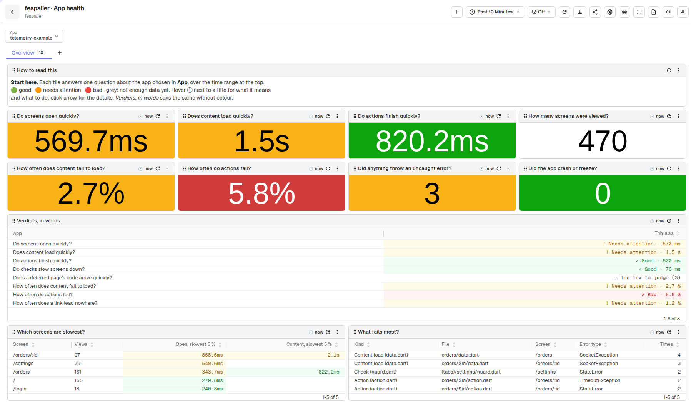
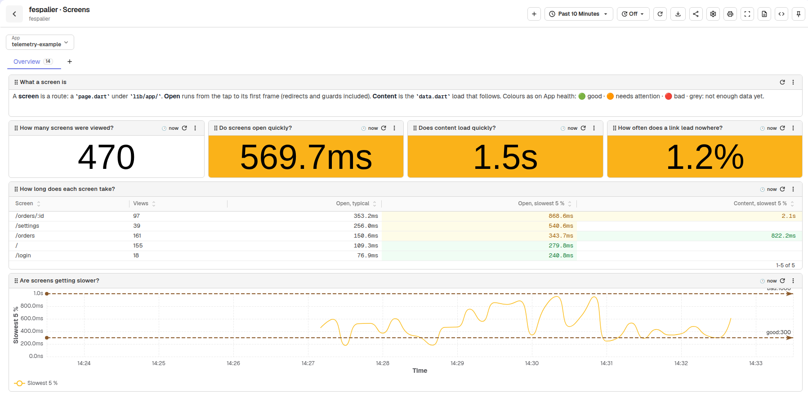
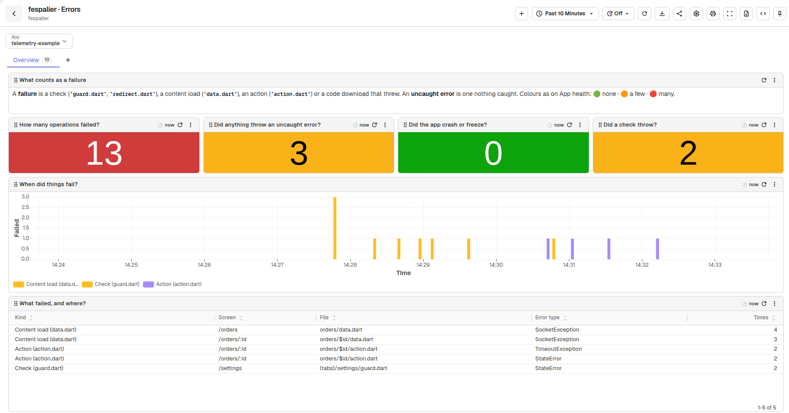
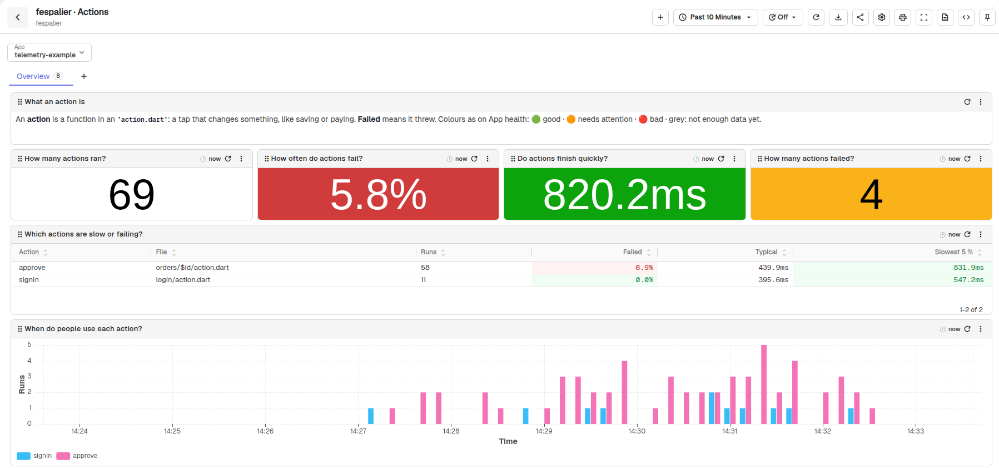
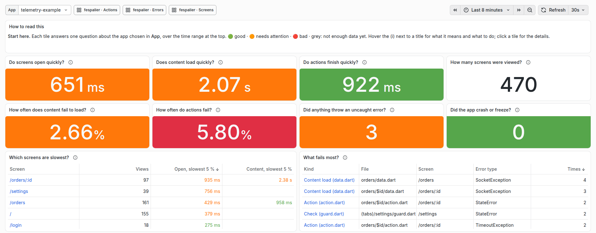
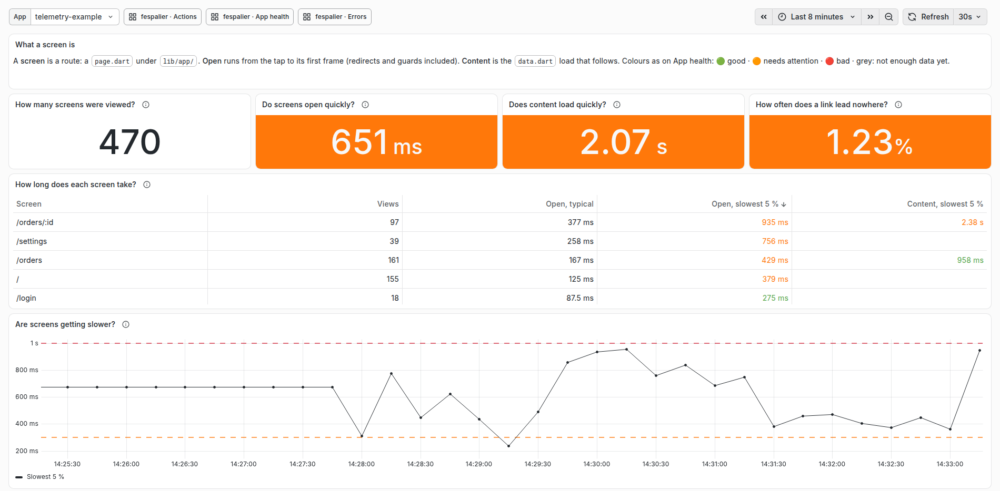

# Dashboards on your computer: `fsp telemetry`

Since 0.8.1. fespalier's telemetry (spans for navigations, guards, `data.dart` loads, actions and deferred loads) is only useful when someone looks at it. `fsp telemetry` starts a stack on your computer that receives it and shows four ready-made dashboards, written as the questions an app developer asks ("Do screens open quickly?", "How often do actions fail?") rather than as metrics: an OpenTelemetry collector, [OpenObserve](https://openobserve.ai), and, with `--grafana`, [Grafana](https://grafana.com) with the same dashboards. It needs [Docker](https://docs.docker.com/get-docker/) with Compose 2.20 or later, and runs in any folder, with or without a project: the stack belongs to you, not to one app.



_Sample data from `scripts/telemetry/seed.py --showcase`._

```sh
fsp telemetry            # the first run pulls about 1.2 GB of images; later runs take a few seconds
flutter run              # any device: an emulator, a simulator, desktop, Chrome
```

```text
✓ telemetry stack running: 4 dashboards in OpenObserve, folder fespalier; start with fespalier · App health
  OpenObserve  http://localhost:5080  dev@fespalier.local / Fespalier-local-1
  OTLP         http://localhost:4318 (HTTP), localhost:4317 (gRPC)
  The app      FespalierOtel.endpoint() reaches it from an emulator, a simulator, desktop and the web
```

Printing the password is deliberate: the stack is local, the password is the documented default, and the web UIs listen on `127.0.0.1` only.

## The app side

The only telemetry-specific value in the app is where it sends to. `FespalierOtel.endpoint()` (in `package:fespalier_otel`) is that value for a development build:

```dart
final observability = OtelZone(
  OtelZoneConfig(serviceName: 'shop', endpoint: FespalierOtel.endpoint()),
);
```

It returns, in this order:

1. what `--dart-define=OTEL_EXPORTER_OTLP_ENDPOINT=...` (or `--dart-define-from-file`) says, when it says anything;
2. `''` in a release build, so `otel_zone` leaves telemetry off and a store build never sends to a developer's laptop;
3. `http://10.0.2.2:4318` on Android (not the web), the emulator's name for its host;
4. `http://localhost:4318` everywhere else: the iOS simulator, desktop and the web.

| Where the app runs      | What reaches the stack                                                                                               |
| ----------------------- | -------------------------------------------------------------------------------------------------------------------- |
| Android emulator        | Nothing to do: `10.0.2.2`.                                                                                           |
| iOS simulator           | Nothing to do: `localhost`.                                                                                          |
| Desktop                 | Nothing to do: `localhost`.                                                                                          |
| Chrome                  | Nothing to do: `localhost`, with CORS ([The web](#the-web-and-otel_zone)).                                           |
| A phone on your Wi-Fi   | `fsp telemetry --lan`, then `flutter run --dart-define-from-file=~/.fespalier/telemetry/dart-defines.json`.          |
| An Android phone on USB | `adb reverse tcp:4318 tcp:4318`, then `flutter run --dart-define=OTEL_EXPORTER_OTLP_ENDPOINT=http://localhost:4318`. |

The port in `endpoint()` is 4318. If you changed `FSP_OTLP_HTTP_PORT`, pass the define.

## The dashboards

Each has an **App** variable (the resource's `service.name`, so apps are told apart in one stack; it starts on the first app) and shows the last hour. They are in OpenObserve's folder `fespalier`, and in Grafana's, where **App health** is the home page. Every title is a question, every panel has an ⓘ (Grafana: (i)) that says what it shows, what good looks like and which file to open when it is not, and every tile is green, amber or red ([Reading the colours](#reading-the-colours)).

| Dashboard                | Answers                                                                                                                                                                                                                                                                                                                                           |
| ------------------------ | ------------------------------------------------------------------------------------------------------------------------------------------------------------------------------------------------------------------------------------------------------------------------------------------------------------------------------------------------- |
| `fespalier · App health` | Start here. Eight tiles: Do screens open quickly? Does content load quickly? Do actions finish quickly? How many screens were viewed? How often does content fail to load? How often do actions fail? Did anything throw an uncaught error? Did the app crash or freeze? Then the same checks in words, the slowest screens, and what fails most. |
| `fespalier · Screens`    | Where people go and how fast each screen opens: its checks (`guard.dart` and `redirect.dart`), its content (`data.dart`) and its code (deferred pages), which screens are busiest, where people go next, and how often a link leads nowhere.                                                                                                      |
| `fespalier · Actions`    | What people do (each function in an `action.dart`): how many runs, how often they fail, how long they take, and when.                                                                                                                                                                                                                             |
| `fespalier · Errors`     | What broke, where and with which error: failed checks, loads, actions and code downloads, uncaught errors, and native crashes and ANRs.                                                                                                                                                                                                           |



_Sample data from `scripts/telemetry/seed.py --showcase`._



_Sample data from `scripts/telemetry/seed.py --showcase`._



_Sample data from `scripts/telemetry/seed.py --showcase`._

Click a row of a table in OpenObserve, or a tile in Grafana, to open the dashboard that explains it (the App and the time range come along). Every query uses only the names of the [telemetry conventions](observability.md#telemetry-conventions), which `scripts/telemetry/build_dashboards.py` reads from `packages/fespalier_otel/lib/src/conventions.dart`, and a test (`scripts/test_telemetry.py`) fails when a query names anything else. Nothing is charted that fespalier does not emit.

## Reading the colours

Since 0.8.1. A tile is **green** when the answer is good, **amber** when it needs attention and **red** when it is bad. "Slowest 5 %" is the time that 19 of 20 are faster than, so one slow outlier does not turn a tile red. The same limits colour the cells of the tables and draw the dashed lines in _Are screens getting slower?_. They are defaults for a mobile app, with a reason each:

| Measure                                               | Good      | Needs attention | Bad       | Why                                                                                                                                                                                                                  |
| ----------------------------------------------------- | --------- | --------------- | --------- | -------------------------------------------------------------------------------------------------------------------------------------------------------------------------------------------------------------------- |
| Opening a screen (`screen_open`)                      | < 300 ms  | 300–999 ms      | ≥ 1000 ms | The span ends at the first frame, so it is the wait before anything moves. 300 ms is Material's screen-transition duration and the edge of "instant"; 1 s is Nielsen's limit for keeping the user's flow of thought. |
| Loading a screen's content (`content_load`)           | < 1000 ms | 1000–2999 ms    | ≥ 3000 ms | The screen already shows loading.dart, so the user is waiting knowingly. 1 s keeps the flow; at 3 s more than half of mobile visitors give up.                                                                       |
| Finishing an action (`action_time`)                   | < 1000 ms | 1000–2999 ms    | ≥ 3000 ms | The same reasoning for a tap that saves: past 1 s it needs a spinner, and past 3 s people tap again.                                                                                                                 |
| A check before a screen (`guard_wait`)                | < 100 ms  | 100–299 ms      | ≥ 300 ms  | A check runs before the screen appears and adds to every open. 100 ms is "instant", and 300 ms would by itself spend the whole budget for opening a screen.                                                          |
| A deferred page's code (`code_download`)              | < 500 ms  | 500–1999 ms     | ≥ 2000 ms | Downloading a deferred page's code on the web: it should fit in a screen transition, and more than 2 s is a visible stall.                                                                                           |
| A load or action that fails (`failure_rate`)          | < 1 %     | 1–4.9 %         | ≥ 5 %     | A 99 % success rate is the usual floor for user-facing calls, and Android's bad-behaviour line for crashes is about 1 %. At 5 %, one attempt in 20 fails.                                                            |
| A link that leads nowhere (`not_found_rate`)          | < 1 %     | 1–4.9 %         | ≥ 5 %     | Typed routes cannot miss, so not-found comes from hand-built links, old deep links and typing on the web. A few are normal; 5 % is a broken link.                                                                    |
| Uncaught errors and failed operations (`error_count`) | 0         | 1–9             | ≥ 10      | While you develop, every uncaught error is worth a look, but a single one should not turn the page red.                                                                                                              |
| Native crashes and freezes (`crash_count`)            | 0         | —               | ≥ 1       | A native crash or an "app not responding" freeze is always bad.                                                                                                                                                      |

**A tile that rests on fewer than 20 samples is grey and says _Not enough data yet_** (and its row in _Verdicts, in words_ says _Too few to judge_): below 20, a "slowest 5 %" is just the biggest value and a percentage jumps 5 % per event. Use the app a little longer, or widen the time range. Colour is never the only signal: OpenObserve's _Verdicts, in words_ says each answer in words (Grafana cannot, because PromQL returns numbers), and each dashboard opens with a legend. To change a limit, edit the dashboard in OpenObserve (the importer then leaves it alone) or keep your own copy ([Your own copy](#your-own-copy)). The limits live in `[thresholds]` of `scripts/telemetry/dashboards.toml`, and a test fails when this table and that spec disagree.

## The flags

| Command                     | What it does                                                                                                                                                                     |
| --------------------------- | -------------------------------------------------------------------------------------------------------------------------------------------------------------------------------- |
| `fsp telemetry`             | Writes the stack's files, runs `docker compose up -d`, waits for the dashboard importer to finish, and prints the addresses.                                                     |
| `fsp telemetry --grafana`   | Also starts Grafana at `http://localhost:3000` (`admin` and the password in `.env`; anonymous visitors can view).                                                                |
| `fsp telemetry --lan`       | For phones: binds the OTLP ports (4317 and 4318) to every interface, for this run, and writes `dart-defines.json` with this computer's address. The web UIs stay on `127.0.0.1`. |
| `fsp telemetry --report`    | Prints how each app is doing, in plain words, and exits: the stack must be running ([A summary in the terminal](#a-summary-in-the-terminal---report)).                           |
| `fsp telemetry --stop`      | Stops the stack and keeps its data.                                                                                                                                              |
| `fsp telemetry --reset`     | Stops the stack and deletes its data (the OpenObserve and Grafana volumes). Use it after changing the OpenObserve password.                                                      |
| `fsp telemetry --dir <DIR>` | Uses `<DIR>` instead of `~/.fespalier/telemetry` (or `FSP_TELEMETRY_DIR`).                                                                                                       |
| `fsp telemetry --no-start`  | Writes the files and prints the command that starts them; does not run Docker.                                                                                                   |

Run from inside an app (or with `--project`), a start also checks that app: when its `fespalier:` section has `telemetry` off, which is the default, `fsp telemetry` prints ``⚠ this app sends no fespalier spans yet: set `telemetry: true` under `fespalier:` in pubspec.yaml and install FespalierOtel (README, "Telemetry")`` after the import and before the summary, and still exits 0. It says nothing outside a project, and not for `--no-start`, `--stop` or `--reset`.

The files go to one folder per user, `~/.fespalier/telemetry` (`%USERPROFILE%` on Windows), not into the app: `flutter clean` cannot delete them, and the Docker project name is fixed (`fespalier-telemetry`), so every app on your computer shares one stack. Running `fsp telemetry` again rewrites any file that differs (an upgrade of `fsp` upgrades the stack) and never touches `.env`.

**Settings** go in `.env` in that folder, written from `env.example` on the first run and never overwritten. Every value has the same default in `compose.yaml`, so the stack also runs with no `.env` at all, as `docker compose up -d` in that folder:

| Key                                        | Default                                                          |
| ------------------------------------------ | ---------------------------------------------------------------- |
| `FSP_O2_EMAIL`, `FSP_O2_PASSWORD`          | `dev@fespalier.local`, `Fespalier-local-1`                       |
| `FSP_GRAFANA_PASSWORD`                     | `Fespalier-local-1`                                              |
| `FSP_OTLP_HTTP_PORT`, `FSP_OTLP_GRPC_PORT` | `4318`, `4317`                                                   |
| `FSP_O2_PORT`, `FSP_GRAFANA_PORT`          | `5080`, `3000`                                                   |
| `FSP_OTLP_BIND`                            | `127.0.0.1` (`--lan` sets `0.0.0.0` for one run)                 |
| `FSP_OTLP_CORS_ORIGIN`                     | `http://localhost`: one more browser origin allowed to send OTLP |
| `FSP_O2_WAIT`                              | `180`: seconds the dashboard importer waits for OpenObserve      |

OpenObserve refuses a weak root password and restarts forever: it needs 8 to 128 characters with a lowercase letter, an uppercase letter, a digit and a symbol. The root user is created on the first start only, so change the password in `.env` and then run `fsp telemetry --reset`. A port that is taken is `FSP_O2_PORT` and the like in `.env`.

## A summary in the terminal: `--report`

Since 0.8.1. `fsp telemetry --report` answers "how is my app doing?" without opening a browser. It runs inside the stack (the host needs no Python), asks OpenObserve the very questions App health asks, and prints one block per app that sent fespalier spans in the last hour:

```text
fespalier · telemetry-example · last hour
  ✓ good               Do screens open quickly?                     240 ms
  ! needs attention    Does content load quickly?                   1.4 s
  ✓ good               Do actions finish quickly?                   310 ms
  ✓ good               Do checks slow screens down?                 60 ms
  … too few to judge   Does a deferred page's code arrive quickly?  4 samples
  ! needs attention    How often does content fail to load?         2.5 %
  ✗ bad                How often do actions fail?                   6.2 %
  ✓ good               How often does a link lead nowhere?          0.4 %
  ✓ good               Did anything throw an uncaught error?        none
  ✓ good               Did the app crash or freeze?                 none
  Slowest screen: /orders/:id, 1.2 s to open and 2.3 s for its content (slowest 5 %, 412 views)
  Fails most: Action (action.dart) orders/$id/action.dart on /orders/:id, 3 × StateError
  Details: http://localhost:5080, Dashboards, folder fespalier, fespalier · App health
```

The mark and the word are the colour, in words. The SQL is read from the generated App health dashboard, so the report and the dashboard cannot disagree, and the limits are [the same](#reading-the-colours). `none` stands for a count of zero, and with nothing failed the "Fails most" line is `Nothing failed.`. Three messages:

- ``fsp telemetry --report needs the stack running: start it with `fsp telemetry` `` when OpenObserve is not running.
- `no fespalier spans in the last hour: is the app running, with telemetry: true and FespalierOtel installed? (README, "Telemetry")` when no app sent a span (exit code 0).
- `fespalier: the report's query failed: HTTP <status>: <body>` when OpenObserve answered with an error (exit code 1), and `the report failed (exit <n>); the lines above say why` when the report stopped for another reason.

## The web and `otel_zone`

A web app posts OTLP/HTTP to the collector from another origin (`http://localhost:<port>` to `http://localhost:4318`), which needs CORS: the collector allows `http://localhost:*` and `http://127.0.0.1:*`, plus `FSP_OTLP_CORS_ORIGIN`. A page served over `https` cannot post to `http://localhost` (mixed content); use `flutter run -d chrome` in development.

**`otel_zone`'s `runGuarded` does not run its body on the web** (checked with `otel_zone` v0.5.0): inside the zone, before the body, it opens a `ReceivePort` from `dart:isolate`, which the web does not have, and the zone's own handler swallows the error. The app stays blank and nothing is printed. `start()` itself works on the web. Until `otel_zone` guards that call, do not use the zone on the web:

```dart
Future<void> zone(Future<void> Function() body) =>
    kIsWeb ? body() : observability.runGuarded(body);
```

## OpenObserve and Grafana show the same numbers

One spec, `scripts/telemetry/dashboards.toml`, generates both: `fsp` embeds the results, and CI fails when they are stale. OpenObserve's panels are SQL over the raw spans and logs; Grafana's are PromQL over metrics that the collector derives from the same spans (and Grafana reads them from OpenObserve, so there is no Prometheus, Tempo or Loki). **Counts are identical**, which the smoke test asserts. These differ:

- Grafana's percentiles are interpolated within histogram buckets (1, 2, 5, 10, 16, 33, 50, 100, 250, 500 ms, 1, 2.5, 5, 10 s); OpenObserve's are computed from the raw durations.
- Span metrics are stamped when the collector receives a span. A batch that a phone replays later counts at the time it arrives in Grafana, and at its own time in OpenObserve.
- Grafana has no error messages or trace ids: its _What failed last?_ is a count table with a link to OpenObserve, and _What was uncaught last?_ exists in OpenObserve only. _Verdicts, in words_ and _Where do people go next?_ exist in OpenObserve only too.
- The percentage tiles agree (the smoke test compares them within 0.05), and a tile that rests on fewer than 20 samples says _Not enough data yet_ in both.
- Grafana shows no words for the colours, because PromQL cannot return a sentence.



_Sample data from `scripts/telemetry/seed.py --showcase`._



_Sample data from `scripts/telemetry/seed.py --showcase`._

## Your own copy

`fsp telemetry --no-start --dir ops/telemetry` writes the stack where you want it, for a team that wants to commit or change it. The folder `cli/templates/telemetry/` in the fespalier repository is the same stack and runs as it is (`docker compose up -d` in it). A dashboard that someone edited in OpenObserve is left alone when a new `fsp` brings a new version (the importer says so; delete the dashboard to get ours back), and Grafana's are read-only (provisioned): save a copy to change one. A dashboard that a newer `fsp` no longer ships is deleted from OpenObserve when nobody edited it, and Grafana drops its file; `fsp telemetry` deletes the stale files in its folder too. The collector file's `span_metrics` and `count` blocks are what to copy into a production collector.

Images are pinned by tag and digest (collector `0.161.0`, OpenObserve `v1.0.4`, Grafana `13.2.3`), for `amd64` and `arm64`.
