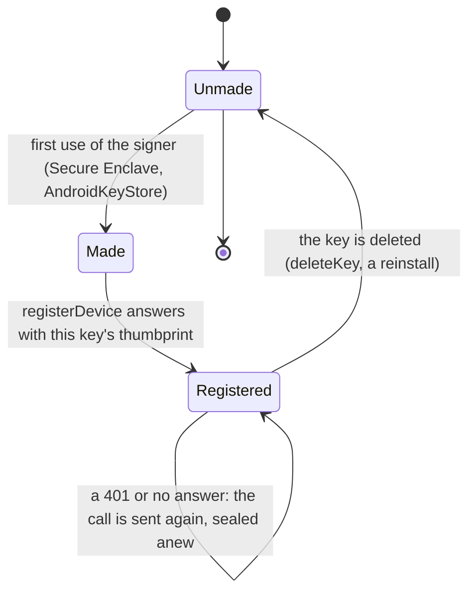

# cose: every request signed, every answer sealed

A small [fespalier](../../README.md) app and the [CrateStack](https://cratestack.dev) server it talks to, in which
**every call is a `COSE_Sign1` message** signed by a key that never leaves the phone, and every answer to it is a
`COSE_Sign1` message signed by the server. The CBOR the unsigned codec would send travels _inside_ it.

It shows, end to end and with tests on both sides:

- the **seam** of [`fespalier_cratestack`](../../packages/fespalier_cratestack): one `CrateStackTransport`
  ([`CoseTransport`](lib/src/cose_transport.dart)) that signs at send time, so intents, reads and the rest of the package
  work unchanged;
- a **device key** from [`fespalier_sign_keypair`](../../packages/fespalier_sign_keypair): the Secure Enclave or the
  AndroidKeyStore on a device, a software key in tests;
- a Dart **COSE sealer and opener** ([`lib/src/cose/`](lib/src/cose)), checked byte for byte against
  `cratestack-cose`'s own test vectors ([`test_vectors/`](test_vectors)), because CrateStack ships no Dart one;
- a Rust **server** ([`server/`](server)) on `cratestack-api` 0.15.3 with no database: an envelope layer that verifies
  the signature, the audience, the operation's contract, the clock and the replay of every request.

Read it with the skills [`fespalier-cratestack`](../../skills/fespalier-cratestack/SKILL.md) (the wiring) and
[`fespalier-offline`](../../skills/fespalier-offline/SKILL.md) (reads that say how current they are, intents).
[CrateStack and fespalier](../../docs/cratestack.md) and [Offline-first](../../docs/offline-first.md) are the pages.

## Run it

Two terminals. The server first (Rust, the toolchain in `server/rust-toolchain.toml`):

```sh
cd examples/cose/server
cargo run --locked -- --listen 127.0.0.1:8787
# {"addr":"127.0.0.1:8787","audience":"fespalier-cose","server_public_jwk":{"crv":"P-256","kty":"EC","x":"...","y":"..."}}
```

It prints one JSON line when it listens. `server_public_jwk` is the key every answer is sealed with: the app **pins** it in
its build, and never learns it from the network.

```sh
cd examples/cose
flutter create . --platforms=android,ios   # adds platform folders only
flutter pub get
flutter run \
  --dart-define=COSE_SERVER_JWK='{"crv":"P-256","kty":"EC","x":"...","y":"..."}' \
  --dart-define=COSE_SERVER_URL=http://127.0.0.1:8787   # 10.0.2.2 from the Android emulator
```

Add a note. The first signed call registers the device key (a plain call), then goes out sealed. Stop the server and add
another: the page says it kept the note under its key; start the server again and tap **Send waiting**.

`startup.dart` opens a `SignKeypairSigner`, which the web, Windows and Linux do not have; for those a build passes a
`SoftwareDpopSigner` (the key lives in memory and is lost at reload). The server forgets devices and notes when it
restarts, and the app registers once per run: after a server restart, signed calls are `401` until the app is restarted too
(see "Not built").

## What is in it

| Path                                            | What it is                                                                                                          |
| ----------------------------------------------- | ------------------------------------------------------------------------------------------------------------------- |
| `lib/app/page.dart`, `data.dart`, `action.dart` | The notes page, `ref.serve` for the signed read, an intent for the signed write. Generated: `lib/app.g.dart`.       |
| `lib/app/startup.dart`                          | Opens the device key and pins the server's (`--dart-define`s); returns the two `fespalier_cratestack` overrides.    |
| `lib/src/cose_transport.dart`                   | `CoseTransport`: payload to CBOR, seal, POST, open the sealed answer, classify every other answer.                  |
| `lib/src/wiring.dart`                           | The providers: signer, identity, HTTP client, `DeviceRegistrar`, and `coseOverrides()`.                             |
| `lib/src/cose/`                                 | `CoseSealer`, `CoseOpener`, `Esp256VerifyKey`, the binding (external AAD) and a minimal CBOR writer and reader.     |
| `lib/src/payload.dart`                          | The CBOR of the payload (JSON-native values in, JSON-native values out).                                            |
| `lib/src/contracts.g.dart`                      | Each operation's contract digest and selector. **Generated** by `server/tests/contracts.rs`; never edited by hand.  |
| `test_vectors/`                                 | `cratestack-cose`'s vectors, copied unchanged (MIT, see `NOTICE`); the Rust and the Dart tests both read this copy. |
| `server/`                                       | The Rust server (`schema.cstack`, `src/`, `tests/`), its own `Cargo.lock` and `rust-toolchain.toml`.                |
| `test/cose/`                                    | The sealer and opener against the vectors (positive: byte for byte; negative: every must-reject).                   |
| `test/transport_test.dart`, `fake_server.dart`  | `CoseTransport` against a server in the test's own process, built from the same sealer.                             |
| `test/home_test.dart`                           | The page over `FakeCrateStackTransport`: the seam's own fake, so no signing is involved.                            |
| `test/e2e_test.dart`                            | The app's transport against the **real** server binary, and every refusal.                                          |

## Why a read is `ref.serve` and a write is an intent

A `CrateStackTransport` is asked to `send` a call once, with an `Idempotency-Key` when it has one. Everything else is
the package's.

- **The read** (`data.dart`) is `ref.serve`: the sealed answer is saved on the device with the time the server gave it,
  and only a `CrateStackOffline` (no network, or an answer that did not open) serves that copy. A 401 is an answer, never
  covered by a copy.
- **The write** (`action.dart`) is an **intent** (`IntentQueue.submit`), not a direct `transport.send`, because it is the
  case that shows why signing belongs _inside_ `send`. The intent stores the call as JSON, encoded once, and sends it
  from the store on every attempt, after a failure and after a restart. Each attempt is therefore a **new message**
  (a fresh `iat` and `cti`, so the server's replay check never sees the same bytes twice) over the **same payload** under the
  **same key**, which the signature binds. A message signed once and stored would be a replay, and a 401, from its second
  attempt on. `registerDevice` is a direct call: it must succeed before anything is signed.

| The transport throws                        | When                                                                                                               | What the intent does                        |
| ------------------------------------------- | ------------------------------------------------------------------------------------------------------------------ | ------------------------------------------- |
| `CrateStackUnauthenticated`                 | an unsigned `401`                                                                                                  | stays pending, **same key**                 |
| `CrateStackRefused` (status, wire code)     | an unsigned `400`, `413`, `415` or `426` (code `HTTP_<status>`, its body ignored); a sealed `4xx` other than `409` | thrown to the person; nothing kept          |
| `CrateStackInFlight` / `CrateStackConflict` | a sealed `409` with / without `Retry-After` (the idempotency layer: the first attempt is still being answered)     | pending, **same key** / kept for the person |
| `CrateStackOffline`                         | no answer; **any other unsigned answer** (`5xx`, `409`, `2xx`, a page); a sealed answer that does not open         | stays pending, **same key**                 |
| `CrateStackUnavailable`                     | a **sealed** `5xx`                                                                                                 | pending, **next key**                       |

Only a sealed answer is the server's word on a call. An unsigned one is believed for the refusals the envelope layer makes
**before the handler runs**, and only by its status: its body is ignored, so nothing on the path can choose the code that
drops an intent. (Anyone on the path can still choose _which_ of `400`, `413`, `415`, `426` a signed call is refused with, and so make a write fail: an accepted risk, since a path that can do that can also drop the connection.) Everything else unsigned stays `Offline`, because it can be a forgery or a failure after the write
landed (the layer answers an unsigned `500` when it cannot seal the answer to a handler that already ran).

A failure to register the device key before a signed call (an unsigned `4xx`, a full registry, a `5xx`) is also `Offline`: the signed call was never sent, and the registration's answer is not the server's word on this write.

A sealed answer that fails to open is `Offline`, never `Unavailable`, on purpose: the write may have landed, and
`Unavailable` would move the intent to the next idempotency key, risking a second write.

## The design, as built

### What travels

`POST /rpc/<op id>` (`procedure.listNotes`, `procedure.addNote`), with

| Header                | Value                                                                                                  |
| --------------------- | ------------------------------------------------------------------------------------------------------ |
| `Content-Type`        | `application/cose; cose-type="cose-sign1"`                                                             |
| `Accept`              | the same                                                                                               |
| `Cratestack-Contract` | the operation's selector: the first 8 bytes of its contract digest, unpadded base64url (11 characters) |
| `Idempotency-Key`     | the intent's `<id>#<attempt>`, for a write                                                             |

The body is `Tag(18)[protected, {}, payload, signature]`. The **payload** is `application/cbor`: `{"args": {...}}`, the
input the unsigned codec would send. The **protected header** is `{1: alg, 4: kid, 15: {6: iat, 7: cti}}` (a response has
`{1: alg, 4: kid}` only): `alg` is ESP256 (-9, ECDSA over P-256 with SHA-256, a 64-byte `r||s`), `kid` the first 8 bytes of
the key's RFC 9679 thumbprint, `iat` the Unix time and `cti` 16 random bytes, fresh for every message.

### What the signature covers

The signature is over `["Signature1", protected, external_aad, payload]`. The **external AAD** is never sent: each side
rebuilds it from its own context, and any disagreement is a `401`. Binding version 2:

```text
[ 2,                      the binding version
  audience,               the server's configured name ("fespalier-cose"), not its host
  "POST", route,          the HTTP method and the operation id
  [], null,               path parameters and query (an RPC call has none)
  contract_sha,           the called operation's contract digest (32 bytes, from lib/src/contracts.g.dart)
  "application/cbor",     the payload's type
  [idempotency_key|null, if_match|null] ]
```

A response adds three more elements: `request_kind` (1: a signed request), the **SHA-256 of the request's exact COSE
bytes**, and the HTTP status. So a message cannot be moved to another server, another operation, another version of the
operation's contract, or another idempotency key, and an answer cannot be moved to another request.

The server also refuses an `iat` more than 300 seconds off its clock and remembers each `(kid, cti)` it has accepted, so the
same bytes twice are a `401`. ESP256 signatures must be **low-s**: the device signers do not promise it, so the sealer
normalises (`normalizeLowS`), and the opener refuses a high one, like the server.

### Registering the key

A request signed by a key the server does not know is a `401`, so the key has to arrive first, and it arrives **unsigned**:
`procedure.registerDevice` takes plain CBOR `{"args": {"x", "y"}}` (the JWK coordinates) and answers plain
`{"kid", "thumbprint"}` as lowercase hex. `DeviceRegistrar` sends it before the first signed call of a run, checks that the
thumbprint is its own, and shares one request between callers that arrive together.

That call **proves nothing about who holds the key**, on purpose: registering a key you do not hold gains the caller
nothing, because a signature is only worth what the server lets a registered key do, and here a key reads and writes its
own notes (the server keys them by the verified thumbprint). A real server would add a proof of possession, or register
through an already-authenticated session.

### Why the response is signed

An intent is **deleted** when the server accepts it. If a `200` could be forged by anything between the phone and the
server (a proxy, a captive portal, a misconfigured gateway), the app would drop a write the server never saw. So the app
accepts only an answer signed by the pinned server key **and bound to this request** (its digest) and **this status**; the
server seals every answer to a signed request that reached the handler, errors included. What it did not seal is the
envelope layer's own refusals from before the handler (the `401`, `415`, `426` of the table below), which the app reads by
status alone, and never as an answer to the write.

### The key's life



There is **no rotation and no revocation**: the demo's registry only grows, in memory, and a restarted server has forgotten
every device. A key deleted on the phone leaves its registration on the server. Both belong to a real server (revoke by
thumbprint; rotate by registering the new key from a session the old one signs).

### One signed call

```mermaid
sequenceDiagram
    participant UI as Page (action / data)
    participant Q as IntentQueue / ref.serve
    participant T as CoseTransport
    participant K as Device key
    participant S as Server (envelope layer)
    UI->>Q: add a note
    Q->>Q: save the call (JSON), key = id#0
    Q->>T: send(RpcCall addNote, idempotencyKey)
    T->>S: POST registerDevice, plain CBOR {x, y} (first call of the run)
    S-->>T: 200 plain {kid, thumbprint}
    T->>T: payload = CBOR {args}; binding = audience, POST, op, digest, idempotency key
    T->>K: sign(Sig_structure(protected{alg, kid, iat, cti}, binding, payload))
    K-->>T: r||s (made low-s)
    T->>S: POST /rpc/procedure.addNote, application/cose sign1, Cratestack-Contract
    S->>S: kid known? signature, audience, op digest, iat in 300 s, cti unseen
    alt every check passes
        S-->>T: 200 application/cose: payload signed by the server, bound to SHA-256(request) and 200
        T->>T: open with the pinned server key and the response binding
        T-->>Q: the Note
        Q->>Q: delete the intent, bump the notes tag
    else any check fails
        S-->>T: 401 unsigned {code unauthenticated}
        T-->>Q: CrateStackUnauthenticated (the intent stays pending, same key)
    end
```

### What the server answers

All of these are observed in `test/e2e_test.dart` against the real binary.

| The request                                                       | Status | Sealed? | The app's `CrateStackFailure`                       |
| ----------------------------------------------------------------- | ------ | ------- | --------------------------------------------------- |
| registration, plain CBOR                                          | 200    | no      | (the answer)                                        |
| a signed call by a registered key                                 | 200    | yes     | (the answer, verified)                              |
| signed by an unregistered key                                     | 401    | no      | `CrateStackUnauthenticated`                         |
| payload, protected header or signature changed in transit         | 401    | no      | `CrateStackUnauthenticated`                         |
| the same bytes twice (the second)                                 | 401    | no      | `CrateStackUnauthenticated`                         |
| `iat` more than 300 seconds off                                   | 401    | no      | `CrateStackUnauthenticated`                         |
| an `Idempotency-Key` header the signature does not cover          | 401    | no      | `CrateStackUnauthenticated`                         |
| plain `application/cbor` to a signed operation                    | 401    | no      | `CrateStackUnauthenticated`                         |
| a COSE body to `registerDevice` (it is the plain operation)       | 415    | no      | `CrateStackRefused` (`HTTP_415`)                    |
| a `Cratestack-Contract` that names no contract the server accepts | 426    | no      | `CrateStackRefused` (`HTTP_426`, update the client) |
| a registered device's bad input (`addNote` without `text`)        | 400    | yes     | `CrateStackRefused`, code `invalid_argument`        |
| a registration that is not a P-256 point                          | 422    | no      | `CrateStackRefused`                                 |
| a sealed answer that does not open (another server key)           | -      | -       | `CrateStackOffline`                                 |

Every unsigned `401` has the same body, `{"code": "unauthenticated", "message": "request could not be authenticated"}`: the
server does not say which check failed. `Accept: application/json` on a signed call is not refused: it is answered sealed.

## Not built, and what was found

- **Device runs.** `SignKeypairSigner` (the Secure Enclave, StrongBox or the TEE) is **not run by any test or by CI**:
  the tests use `FakeDpopSigner`, a software key that signs the same way, and the app has not been run on a phone. The
  [`fespalier_sign_keypair`](../../packages/fespalier_sign_keypair) package tests the signer itself.
- **The idempotency store is in memory.** The server runs CrateStack's `IdempotencyLayer` over `server/src/idempotency.rs`,
  inside the envelope layer, so it sees the plain CBOR the envelope unwrapped (the same bytes on every attempt) and the
  verified device as the principal: a write whose answer was lost and that is sent again under its key runs once, and the
  replay is sealed anew for the request that asked (`test/e2e_test.dart`, "a write whose answer was lost"). A restart
  forgets the keys, and with them the guarantee; a real server uses `SqlxIdempotencyStore` or Redis. Only a verified device holds keys (`keys_for_verified_callers_only` drops the header from anyone else, so a flood of junk keys and `Authorization` headers cannot fill the store), each device holds at most 200 live keys, and a full store answers a sealed `503`, which the app keeps its write through (`Unavailable`, the next key; safe because the reservation fails before the handler runs). The same key from two devices is two entries.
- **Refusals from the headers.** The envelope layer refuses a wrong content type, a plain request to a signed operation and
  an unknown contract selector before it reads the body, and hyper then closes the connection with the body unread, which
  the OS turns into a reset the client could see before the answer (`CrateStackOffline` for a `426`, "update the client").
  The example's server reads the whole body first (`read_body_first`, the outermost layer in `server/src/lib.rs`), so every
  refusal is an answer (a body past the limit is read and discarded up to four limits further before the `413`, a read
  error is a `400`): 300 such refusals over one pooled client lose none (`test/e2e_test.dart`). A server without that
  layer shows the race.
- **No registration proof, rotation or revocation** (above), and the registry and notes are in memory.
- **Plain HTTP on a local network.** The demo server speaks `http://`. The signature protects the messages, not their
  privacy: put a real server behind TLS, and Android needs a cleartext allowance for `10.0.2.2` in debug.
- **Ed25519.** The sealer speaks ESP256 only (pointycastle has no Ed25519); the vector tests use a test-only Ed25519
  verifier to check the header and binding rules for those vectors.
- **The local store is in memory** (`InMemoryLocalStore`, the package's default): intents survive the transport's
  failures but not a restart. A real app overrides `localStore` with `HiveLocalStore`.
- **No automatic drain.** The page has a **Send waiting** button; `autoSync` with the reconnect signal is the package's
  answer ([Offline-first](../../docs/offline-first.md)).

## Tests

```sh
cd examples/cose && flutter pub get && flutter test           # the end-to-end test skips, saying why
cd server && cargo build --locked && cd ..
COSE_SERVER_BIN=$PWD/server/target/debug/cose-demo-server FSP_REQUIRE_COSE_SERVER=1 flutter test
```

`FSP_REQUIRE_COSE_SERVER=1` makes a missing `COSE_SERVER_BIN` a failure instead of a skip, so CI cannot go green by not
running the server. `just cose` from the repository root runs the server's gates and then these. After changing
`server/schema.cstack`, `FSP_UPDATE_GOLDEN=1 cargo test --test contracts` in `server/` rewrites `contracts.json` and
`lib/src/contracts.g.dart`; both tests fail when either is stale.
